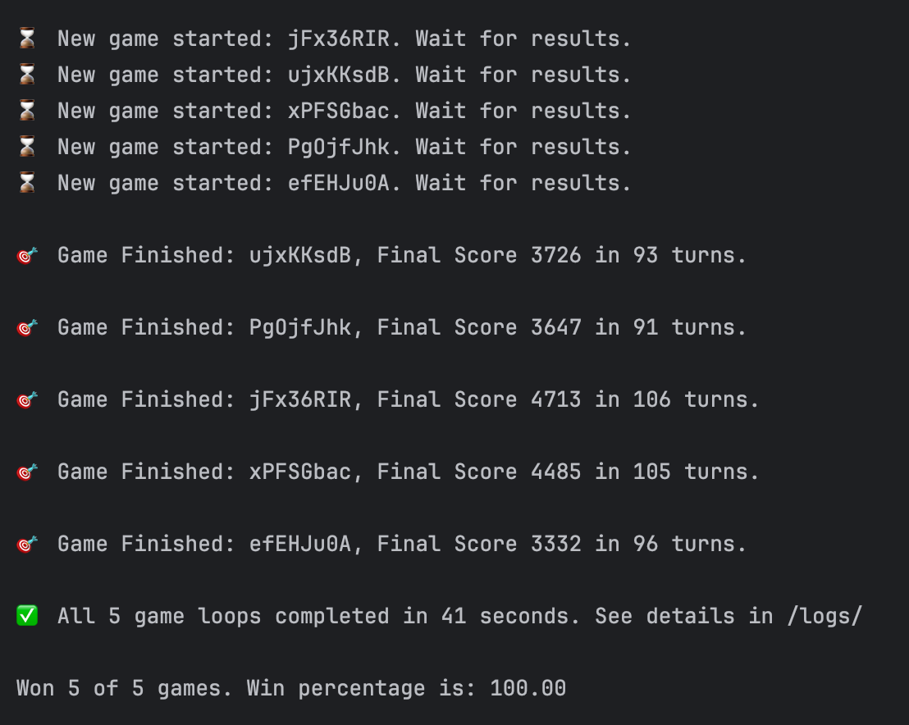
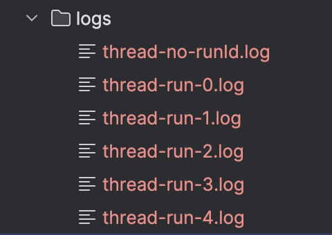

# Dragons of Mugloar Game

_A Spring Boot app which plays Dragons of Mugloar game and tries to reach at least 1000 point in every run._

---

## 🚀 How to run?

* Clone the repo: 
> git clone https://github.com/samir-amanov/dragons-of-mugloar.git
* go to the folder: 
> cd dragons-of-mugloar

### Option 1: Run as a Spring Boot App (Requires Java 21 & Maven)
> mvn spring-boot:run

### Option 2: Run with docker command
> docker-compose up --build

---

## 📝 General information

* This app plays Dragons of Mugloar game in parallel in several threads.
* Number of parallel runs given in application.properties file (5 by default):
> dragons.parallel-runs=5
* Prints game results to the console. Example:

* Adds detailed logs separated by thread to the /logs folder. Example:

